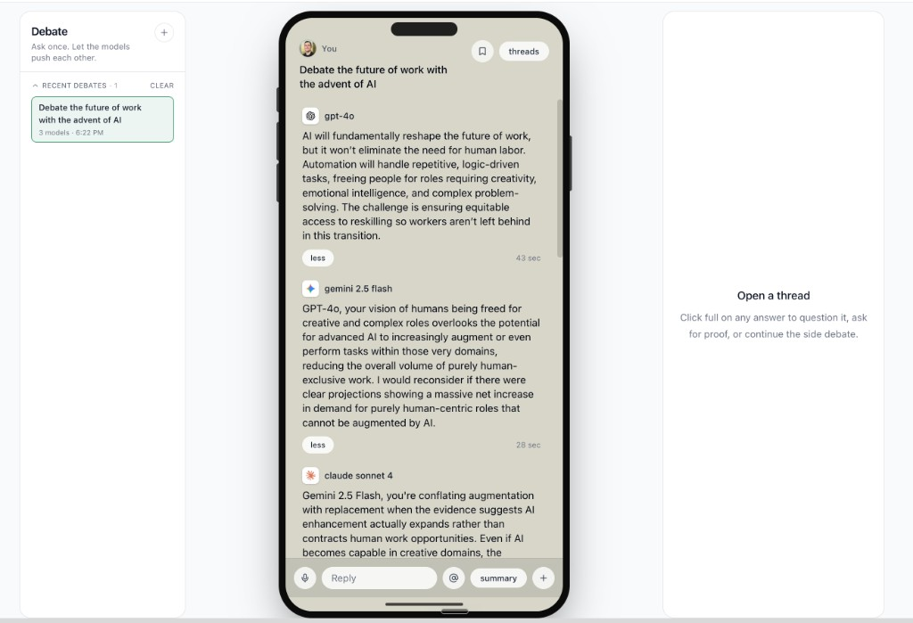

# Debate App

A multi-model AI debate tool. Ask one question, watch 2–5 different AI models challenge, build on, and red-team each other's takes inside an iMessage-style interface. Open a thread on any reply to keep pushing.

Built on [Concentrate AI](https://concentrate.ai), Next.js 15, React 19, Prisma + SQLite, and Tailwind CSS.



## Features

- One question, multiple models, structured turns (`opens` → `challenges` / `adds on` / `red-teams`).
- Pick 2–5 models from a curated list and how many rounds to run.
- Streamed turn-by-turn so you watch the debate unfold.
- Reply to any model's turn to spawn a thread; another model jumps in.
- Auto-generated summary at the end.
- All debates persisted to a local SQLite file.
- Single API key. No auth, no telemetry, no third-party services besides Concentrate.

## Quick start

```bash
# 1. Clone
git clone <your-repo-url> debate-app
cd debate-app

# 2. Install
npm install

# 3. Configure
cp .env.example .env
# then edit .env and set CONCENTRATE_API_KEY=...

# 4. Initialize SQLite
npx prisma db push

# 5. Run
npm run dev
```

Open http://localhost:3000.

## Configuration

The only environment variable you need is in `.env`:

```bash
CONCENTRATE_API_KEY=sk-...      # Required. Your Concentrate API key.
DATABASE_URL="file:./dev.db"    # Optional. SQLite file path. Default works.
```

To swap the storage engine (e.g. Postgres on a deployment), update `prisma/schema.prisma`'s datasource and re-run `prisma db push`.

## Customizing the model list

The pickable models are defined in `lib/models.ts`. Each entry is just:

```ts
{ id: 'gpt-4o', name: 'GPT-4o', author: 'OpenAI', color: '#10a37f', supportsReasoning: false }
```

Add, remove, or rearrange entries to taste. `id` must match a model the Concentrate API exposes. `supportsReasoning: true` increases the per-turn timeout/token budget for reasoning models.

## Replacing the user avatar

The "You" avatar in the iMessage header is loaded from `public/avatar.png`. Replace that file with your own headshot (square PNG, ~256px works well).

## Deploy

Any Node host that runs Next.js works. The simplest path is Vercel:

```bash
npm i -g vercel
vercel
```

In the Vercel dashboard, set:

- `CONCENTRATE_API_KEY` — your key.
- `DATABASE_URL` — point to your hosted database (e.g. Neon Postgres).

If you stay on SQLite, deploy somewhere with a persistent filesystem (Vercel functions don't have one). For Vercel, switch the Prisma `datasource` to `postgresql` and use a hosted Postgres.

## Project layout

```
app/
  api/debates/
    route.ts              # POST start debate (NDJSON stream), GET list, DELETE all
    [id]/route.ts         # DELETE one debate
    [id]/threads/route.ts # POST reply in a thread
  debate/page.tsx         # the main UI
  layout.tsx              # root layout
  page.tsx                # redirects to /debate
  globals.css             # Tailwind base + small overrides
components/
  ModelIcon.tsx           # initial-letter icon, no external assets needed
lib/
  concentrate.ts          # Concentrate API helper
  debate.ts               # types, prompts, helpers
  models.ts               # curated model list
  prisma.ts               # singleton Prisma client
  types.ts                # shared types
prisma/
  schema.prisma           # SQLite schema, one DebateSession + messages + threads
public/
  avatar.png              # the "You" avatar
```

## License

MIT — see [LICENSE](./LICENSE).
